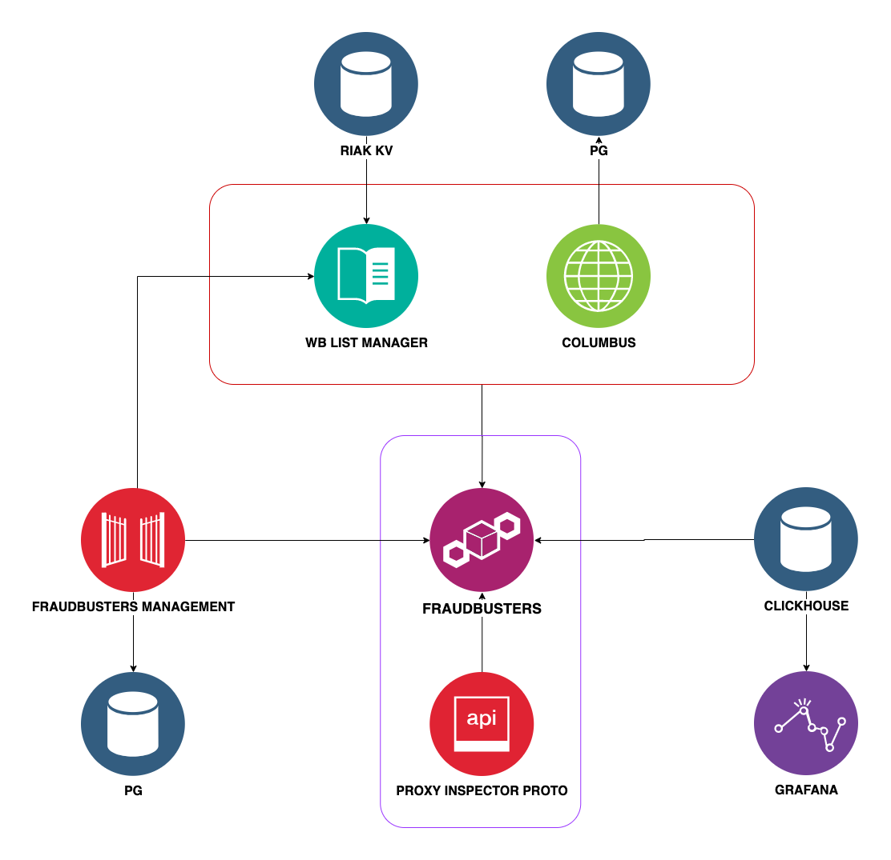

# Fraudbusters 

Service for fraud detection.

It is a tool for describing behavioral patterns for fraudulent transactions, it provides the ability 
to check for compliance with the described patterns.

### Template Description Language

[Fraudo DSL](https://github.com/rbkmoney/fraudo)

### The following protocols are implemented for interaction
[Apache Thrift](https://thrift.apache.org/) is used to describe the protocols.

- [Proxy Inspector](https://github.com/rbkmoney/damsel/blob/master/proto/proxy_inspector.thrift) - 
protocol for inspection payment for mismatch
- [Fraudbusters Proto](https://github.com/rbkmoney/fraudbusters-proto/blob/master/proto/fraudbusters.thrift) -
protocol for managing a set of patterns and bindings

### Service Interaction Topology

Fraudbusters is a central service that accepts templates from a management service and
responds to inspection requests from external systems, for checks in black / white / named lists.
Interacts with wb-list-manager based on protocol
[wb-list-proto](https://github.com/rbkmoney/wb-list-proto/blob/master/proto/wb_list.thrift)
also interacts with ClickHouse to collect aggregates and fill in the necessary audit data (JDBC).
When analyzing the results, it enriches the data from the storage location service by ip addresses
[Columbus](https://github.com/rbkmoney/damsel/blob/master/proto/geo_ip.thrift)



### Install

```docker-compose up -d```

### License
[Apache 2.0 License.](/LICENSE)

